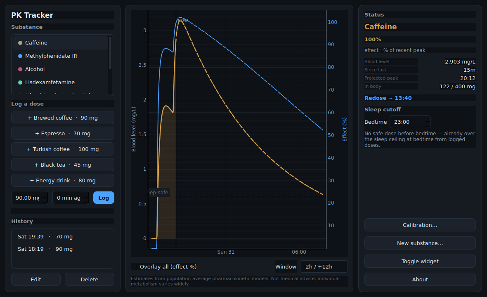
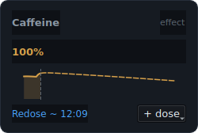
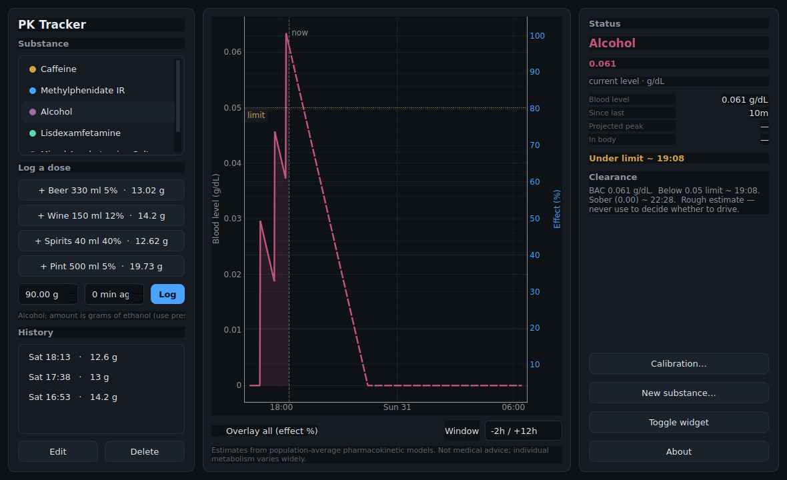
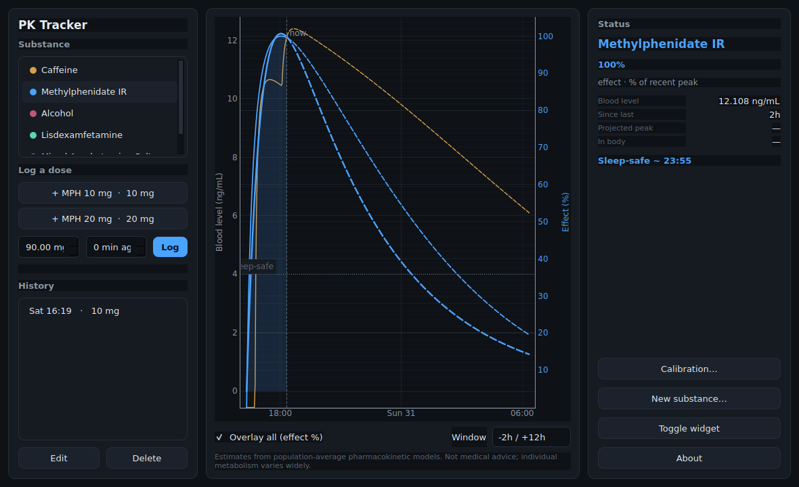
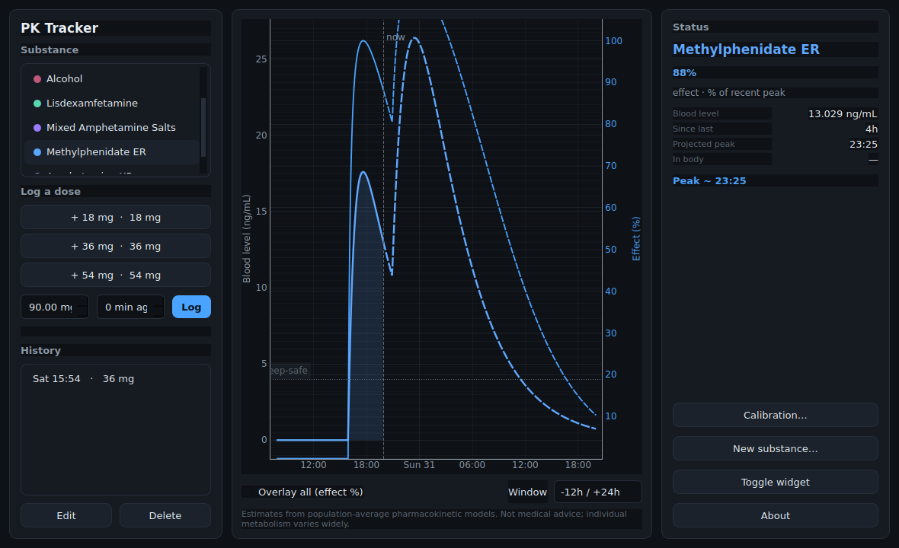

# PK Tracker

A lightweight desktop instrument that models how psychoactive substances rise
and fall in the body over time, and visualises both the **blood concentration**
(objective pharmacokinetics) and the **perceived effect** (subjective
pharmacodynamics, calibrated per user).

It is a quantified-self tool, not a medical device. Every number comes from a
population-average model; individual metabolism varies widely.



> 🌐 **Languages:** English · [עברית — מדריך שימוש מלא](README.he.md)

## ⬇️ Install on Windows (no command line)

No Python, no terminal. Four steps:

1. **Download** → **[PKTracker-Setup.exe](https://github.com/eitanav/coffe-thing/releases/download/v1.0.0/PKTracker-Setup.exe)** (the download starts immediately; ~100 MB).
2. **Double-click** the downloaded file.
3. If a blue **"Windows protected your PC"** box appears (normal for new, unsigned
   apps — not a virus): click **More info → Run anyway**.
4. Click **Next → Finish**. Done — it adds a Start-menu (and optional desktop)
   shortcut and launches. Next time, just click the **PK Tracker** icon.

<details>
<summary>Prefer no install? Portable version</summary>

Download **[PKTracker-portable-windows.zip](https://github.com/eitanav/coffe-thing/releases/download/v1.0.0/PKTracker-portable-windows.zip)**,
right-click → **Extract All**, then double-click **`PKTracker.exe`**.
</details>

> All downloads are also on the **[Releases page](../../releases/latest)**. Builds
> are produced automatically on a clean Windows machine by GitHub Actions; running
> from source (below) still works on any OS.

---

## What it does

Two surfaces:

- **Main dashboard** — substance selector, dose logging, the live blood-level +
  effect plot (with a legend: the coloured line is **blood level**, the blue line
  is **effect %**, solid = so far, dashed = projected), history, status readout,
  sleep-cutoff solver, calibration, and a custom-substance builder. Logging a
  dose shows a confirmation with the resulting level.
- **Floating widget** — a small frameless panel showing the current state of the
  active substance at a glance, with a `+ dose` button. It opens automatically
  and defaults to **pinned to desktop** (sits behind other windows like a
  gadget); switch it to **float on top** from Settings or its right-click menu.
- **Settings** (button or tray) — one place for the **theme** (dark / light),
  the widget (show/hide, pinned vs float), and links to calibration and custom
  substances. Closing the main window keeps the app alive in the system tray.

| Floating widget | Alcohol clearance | Overlay (effect %) |
|---|---|---|
|  |  |  |

The extended-release model shows its characteristic double-pulse plateau — an
immediate fraction, a dip, then a delayed second pulse:



---

## Quick start

```bash
# 1. Install (a virtualenv is recommended)
pip install -r requirements.txt

# 2. Run the app
python -m pk_tracker.app      # or:  python run.py

# 3. Run the math/persistence tests
pip install -r requirements-dev.txt
python -m pytest pk_tracker/tests/ -q
```

Stack: **Python 3.11+, PySide6 (Qt6), SQLite, NumPy/SciPy, pyqtgraph.** Single
user, local machine, no cloud, no accounts, no network calls. The SQLite
database lives at `~/.pk_tracker/pk_tracker.sqlite`.

> PySide6 (LGPL) is used deliberately rather than PyQt6 (GPL/commercial), to keep
> the project free to distribute and relicense.

---

## Usage

1. **Pick a substance** in the left list (Caffeine, Alcohol, a prescription
   stimulant, or your own).
2. **Log a dose** — tap a preset, or type an amount and optionally how many
   minutes ago, then **Log**. Edit or delete past doses from **History**.
3. **Read the plot** — the filled coloured line is the **blood level** (left
   axis); the dashed blue line is the **effect** as a percent of your recent
   peak (right axis). Solid = past, dashed = projection, with a **now** marker.
   Use **Window** to change the span and **Overlay all** to compare substances.
4. **Status panel** (right) — current effect/level, time since last dose,
   projected peak, and (caffeine) amount in body vs the jitter threshold.
5. **Caffeine** also gets a **redose nudge** (effect below ~30%) and a **sleep
   cutoff**: set a bedtime and a **target** (≤ X% of a dose's peak still in your
   blood at bedtime) to see the latest safe coffee time — and get a tray nudge
   ~30 min before it, so you know when to stop in advance.
6. **Alcohol** — pick *Alcohol*, then **tap a drink** (Beer / Wine / Spirits /
   Pint) to log it; the custom box takes grams of pure ethanol (≈14 g per
   standard drink). It shows BAC and estimated times to drop below the driving
   limit and to reach 0.00 — estimates only, never a basis for deciding to drive.
7. **Floating widget & tray** — a small status widget opens automatically at
   startup, **pinned to the desktop** by default. Right-click it (or use Settings
   / the tray menu) to switch to **Float on top**, or hide it. Closing the main
   window keeps the app running in the system tray. Note: this is the app's own
   floating panel, not a Windows 11 Widgets-board widget (a different Microsoft
   technology).
8. **Settings** — choose the **theme** (dark / light) and control the widget in
   one place. **Calibration** sets body mass, sex, and per-substance tolerance;
   **New substance…** adds your own.

Prescription medicines (methylphenidate, amphetamines) are **visualise-only** —
no dosing prompts of any kind.

> 🇮🇱 הסבר מלא ופשוט בעברית: **[README.he.md](README.he.md)**

---

## The core idea: separate *concentration* from *effect*

This is the conceptual centrepiece, and the two are never collapsed into one:

- **Blood level** is objective pharmacokinetics — how much substance is in the
  blood. It depends only on the dose, the timing, and the body's clearance.
- **Effect** is subjective pharmacodynamics — how much you *feel* it. The same
  blood level produces a different effect in a habituated user than in a naive
  one.

**Tolerance is pharmacodynamic, not pharmacokinetic.** A regular caffeine
drinker does not clear caffeine faster; their receptors have down-/up-regulated
so they feel less from the same blood level. So the tolerance factor shifts the
*effect* curve and **never** touches `ke` or the concentration curve. The plot
shows both traces — "Blood level" (left axis) and "Effect" (right axis, as a
percent of your own recent peak).

---

## The math

The math layer (`pk_tracker/core/models.py`) is pure, closed-form, and fully
unit-tested. There is **no background simulation loop**: to render the state at
any instant, the engine evaluates the analytic model at `t = now` from the
timestamped dose log. Shut the machine down, reopen it tomorrow, and the curve
is recomputed from scratch — there is no internal state to corrupt.

### 1. Linear one-compartment model with first-order absorption (Bateman)

Used for caffeine, methylphenidate, and the stimulant prodrugs. A single dose:

```
C(t) = (F · D · ka) / (V · (ka − ke)) · ( e^(−ke·t) − e^(−ka·t) )      for t ≥ 0
```

- `D` dose (mg), `F` bioavailability, `V` volume of distribution (L =
  `v_l_per_kg · body_mass`), `ka` absorption rate (1/h),
  `ke = ln(2) / half_life` elimination rate (1/h).
- Time of peak: `Tmax = ln(ka/ke) / (ka − ke)`.
- The `ka == ke` singularity is handled with its analytic limit
  `C(t) = (F·D·ka/V) · t · e^(−ka·t)`.

Because the model is **linear**, multiple doses combine by **superposition** —
the total is just the sum of single-dose curves, each shifted to its own time:

```
C_total(t) = Σ_i  C_single(t − t_i)
```

The lisdexamfetamine prodrug is a nice special case: its slow red-blood-cell
conversion to d-amphetamine *is* the absorption step, so the same Bateman form
applies with `ka` = the conversion rate.

### 1b. Extended release: two superposed Bateman pulses

Real ER formulations (Concerta, Adderall XR) deliver a dose in two waves. The
model superposes an immediate pulse and a delayed one:

```
C(t) = C_single(t; frac_ir·D, ka)  +  C_single(t − lag; (1−frac_ir)·D, ka2)
```

`frac_ir` is the fraction released immediately; the rest is released after
`lag` hours, optionally with its own absorption rate `ka2`. This produces the
flatter, longer plateau (and the visible double hump) seen above.

### 2. Pharmacodynamics: a tolerance-shifted Emax response

```
Effect(t) = Emax · C(t) / ( EC50 · tolerance_factor + C(t) )
```

`tolerance_factor ∈ [0.5, 1.5]`: 0.5 = sensitive/naive (a little goes a long
way), 1.5 = habituated (needs more for the same effect). Effect is displayed as
a percentage of the user's own recent peak so "you're at 30%" is personal and
meaningful.

### 3. Alcohol: the Widmark model, zero-order elimination

Alcohol's metabolising enzyme saturates after the first drink, so elimination
is **zero-order** — a straight line down, not an exponential:

```
BAC(t) = max( 0,  A / (r · M · 10)  −  beta · t )
```

- `A` grams of pure ethanol = `volume_ml · (abv%/100) · 0.789`,
- `r` Widmark ratio (~0.68 male, ~0.55 female), `M` body mass (kg),
- `beta` elimination rate (default 0.015 g/dL/h), the factor 10 converts to
  g/dL.

Zero-order elimination means drinks do **not** superpose; the engine walks the
piecewise-linear trajectory forward, flooring at zero, so two spaced drinks
correctly accumulate less than the naive sum of two peaks.

### Sleep cutoff (caffeine)

Latest time you can take a dose and still have it decay below a bedtime ceiling.
For a single decaying contribution the elimination phase inverts to:

```
t_allowed = (1/ke) · ln( C_current / C_target )
```

For the general case (existing doses still on board), the cutoff is found by
root-finding against the superposed curve, requiring the candidate dose to have
peaked at least one `Tmax` before bedtime.

---

## Default constants and their sources

All constants are population averages with wide individual variation. They are
**defaults, not truth**, and every one is overridable per substance and per user
in Settings.

| Substance | half-life | ka (1/h) | F | Tmax | EC50 | Sources / notes |
|---|---|---|---|---|---|---|
| Caffeine | 5.0 h | 5.0 | 0.99 | ~45 min | 1.0 mg/L | half-life mean ~5 h (range 2–8); Tmax 30–120 min; F ~99% (EFSA; NIH StatPearls) |
| Methylphenidate IR | 3.5 h | 1.3 | 0.30 | ~1.7 h | 11 ng/mL | half-life 2–4 h; Tmax 1–2 h; high inter-individual variability |
| Alcohol | — (zero-order) | — | — | 30–90 min | — | Widmark; Vmax ≈ const `beta` 0.010–0.025 g/dL/h; r 0.68/0.55 |
| Lisdexamfetamine | 11 h (active) | 0.693 (RBC conversion) | 0.295 | 3–5 h | 11 ng/mL | prodrug; conversion half-life ~1 h; **visualise only** |
| Mixed amphetamine salts | 11 h | 1.0 | 0.75 | ~3 h (IR) | 11 ng/mL | blended d/l-amphetamine single curve; **visualise only** |
| Methylphenidate ER | 3.5 h | 1.3 + 0.5 (2nd pulse) | 0.30 | ~6–8 h | 11 ng/mL | bimodal: 40% immediate + 60% delayed 5 h; **visualise only** |
| Amphetamine XR | 11 h | 1.0 (both pulses) | 0.75 | ~8–10 h | 11 ng/mL | double-pulse: 50% immediate + 50% delayed 4 h; **visualise only** |

Caffeine sanity checks: brewed coffee ~80–100 mg, espresso ~60–80 mg/shot.
Turkish/unfiltered coffee retains grounds, so absorption is a little more
sustained (model with a marginally lower `ka` if desired).

---

## Behaviour & scope rules (enforced in code, not just the UI)

| Substance | Concentration | Effect | Redose nudges | Sleep cutoff | Notes |
|---|---|---|---|---|---|
| Caffeine | yes | yes | **yes** | **yes** | full feature set |
| Methylphenidate | yes (viz) | yes (viz) | no | no | prescription: visualise only, no dosing prompts |
| Alcohol | yes (BAC) | optional | no | n/a | sobriety/clearance predictor only; never prompts more intake |
| Lisdex / amphetamines | yes (viz) | yes (viz) | no | no | prescription stimulants: visualise only |
| Methylphenidate ER / Amphetamine XR | yes (viz, bimodal) | yes (viz) | no | no | extended-release: visualise only |
| Custom | per model | optional | opt-in (stimulant-like only) | opt-in | added from the UI, persisted to `substances.json` |

The redose nudge and the sleep-cutoff dosing directive are **caffeine-first**.
The scheduler returns an ineligible result for any non-redose substance, and the
UI hides those panels — alcohol and prescription medicines never get a dosing
prompt of any kind.

---

## Safety & disclaimers

- This app provides **estimates** from population-average pharmacokinetic models
  and is **not medical advice**. Individual metabolism varies widely.
- The methylphenidate (and other prescription) modules are visualise-only:
  dosing of prescription medication is determined by your prescribing physician;
  this tool only draws an estimated curve and never recommends doses.
- Alcohol BAC and sober-time figures are **rough estimates** and must **not** be
  used to decide whether it is safe or legal to drive.
- No feature prompts increased intake of alcohol or a prescription medicine.

---

## Architecture

```
pk_tracker/
  core/            # pure PK/PD math — no UI imports, fully unit-tested
    models.py        # Bateman, superposition, ER bimodal, Emax, Widmark
    substances.py    # Substance/Preset definitions + JSON library loader
    engine.py        # dose log + models -> concentration/effect over time
    scheduler.py     # redose nudge, sleep-cutoff solver, alcohol clearance
  data/
    schema.sql       # SQLite schema
    db.py            # typed CRUD; seeds the library on first run
    substances.json  # editable substance library (defaults + user-added)
  ui/                # PySide6: theme, plots, main window, widget, tray, settings
  controller.py      # service layer between UI and core/data
  app.py             # entry point
  tests/             # the math and persistence are the most-tested code
```

Key principle: **the dose log is the single source of truth, and concentration
is a pure function of the dose log and the current time.** `core/` imports
nothing from `ui/`; the math is independent and testable in isolation. A UI
timer fires every few seconds only to redraw and re-check alerts — it does not
advance a simulation.

---

## Tests

The math layer is the heart of the project, so it carries the most tests
(single-dose peak time/value, superposition, decay-to-target, the `ka==ke`
limit, Widmark reaching zero, unit handling, tolerance, the scheduler scope
rules, and the persistence round-trips):

```bash
python -m pytest pk_tracker/tests/ -q
```

---

## Packaging

A PyInstaller spec builds a single-file executable:

```bash
pip install pyinstaller
pyinstaller pk_tracker.spec      # -> dist/PKTracker  (Windows: dist\PKTracker.exe)
```

The spec bundles the data files (`schema.sql`, `substances.json`) at their
package-relative paths and trims unused Qt modules. Build on the target OS to
get a native binary (build on Windows for the `.exe`).

## Changelog & roadmap

Released changes are in [`CHANGELOG.md`](CHANGELOG.md); planned features and
fixes are in [`TODO.md`](TODO.md).

## Roadmap / non-goals

Implemented refinements: a bimodal extended-release model (two Bateman pulses —
Methylphenidate ER, Amphetamine XR) and an optional alcohol absorption ramp (set
the window in Calibration; 0 = instantaneous). Still open: ER ascending-dose
profiles beyond two pulses.

Explicit non-goals: no webcam/screen capture or continuous sensing; no
background compute loop; no cloud sync, accounts, or network calls; no redose or
"consume more" prompts for alcohol or prescription medicines; no mobile build.
